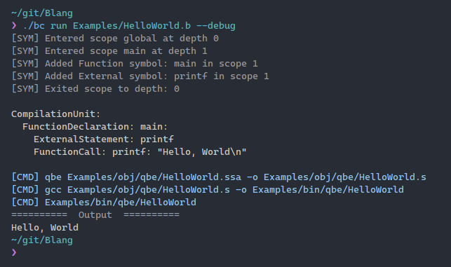

# B Langauge implementation

Implementing the B lang in C# with qbe backend

## Screenshot

## Currently Implemented

-   [x] function definitions
-   [x] extrn
-   [x] function calls
-   [x] auto
-   [x] variable assignment
-   [x] math `foo = (1 + 2 * 3)` foo = 7
-   [ ] Global variables
-   [ ] if else
-   [ ] while
-   [ ] switch

## Targets

-   qbe

## Dev Setup

-   Dotnet 8
-   QBE executable either build from source or use the linux-x86_64 one in `misc/qbe`

## References

-   [QBE Docs](https://c9x.me/compile/doc/il.html)
